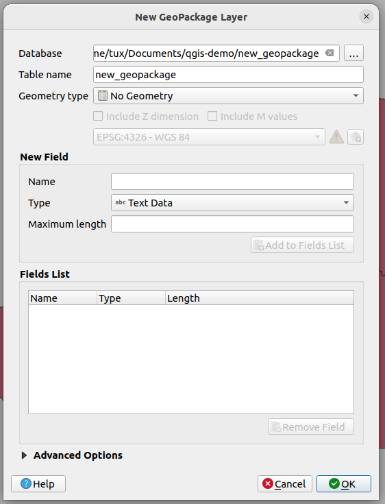
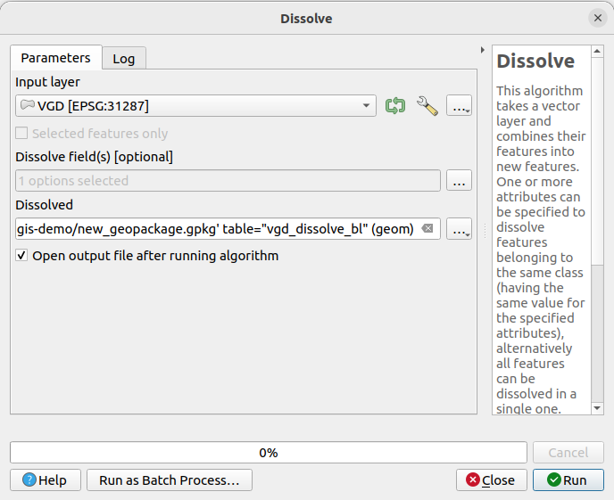

# qgis-demo

## Installation qgis
- Ubuntu 22.04.4 LTS
- https://qgis.org/en/site/forusers/alldownloads.html#debian-ubuntu
    - QGIS 3.36 (20240413)

## Daten

### Demo 1 Koordinatenreferenzsysteme
- Natural Earth: https://www.naturalearthdata.com/downloads/50m-raster-data/50m-cross-blend-hypso/

### Demo 2 Web Services
- 

- Verwaltungsgrenzen: https://data.bev.gv.at/geonetwork/srv/eng/catalog.search#/metadata/2d6ae2c7-af9e-4046-b54c-ee907964ee01
- DLM-Bauten: https://data.bev.gv.at/geonetwork/srv/eng/catalog.search#/metadata/6a5b702d-fc01-4230-9a70-7fccee20d01a

## Demo
1) Erstellen GeoPackage

Rechtsklick auf gewünschtes Verzeichnis > New GeoPackage

### Anzahl der Schulen in den österreichischen Bundesländern
1) Dissolve VGD (anhand BL)
Processing > Processing Toolbox > Dissolve

2) Join Attributes By Location
- Laden der Daten DLM_2000_BAUTEN_20230912.gpkg\BAU_2100_KOMMUNAL_P
- Select by Expression: F_NAME='Schule'
- Processing > Processing Toolbox > Join Attributes By Location (Summary) (Fields: id, summaries: count)

!!! Das hat noch nicht funktioniert !!! --> jetzt schon, mit contains!nd

3) Drop Fields von Join Layer