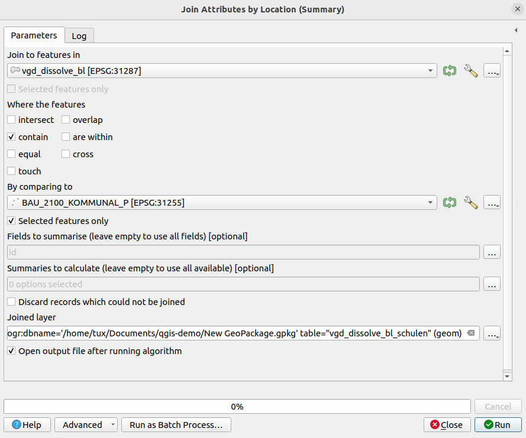

# QGIS-Demo

## Installation QGIS
- Ubuntu 22.04.4 LTS
- https://qgis.org/en/site/forusers/alldownloads.html#debian-ubuntu
    - QGIS 3.36 (20240413)

## Daten

### Demo 1 Koordinatenreferenzsysteme
- Natural Earth: https://www.naturalearthdata.com/downloads/50m-raster-data/50m-cross-blend-hypso/

### Demo 2 Web Services
- Open Street Map Basemap aus XYZ-Tiles
- BEV Katasterservice


- BEV AMap

https://maps.bev.gv.at/tiles/{layer}/{z}/{x}/{y}.png

Für aktuelle KM:
https://maps.bev.gv.at/tiles/karte/{z}/{x}/{y}.png

Für 3. LA:
https://maps.bev.gv.at/tiles/EPO1/{z}/{x}/{y}.png

### Demo 3 Analyse
- Verwaltungsgrenzen: https://data.bev.gv.at/geonetwork/srv/eng/catalog.search#/metadata/2d6ae2c7-af9e-4046-b54c-ee907964ee01
- DLM-Bauten: https://data.bev.gv.at/geonetwork/srv/eng/catalog.search#/metadata/6a5b702d-fc01-4230-9a70-7fccee20d01a

1) Erstellen GeoPackage

Rechtsklick auf gewünschtes Verzeichnis > New GeoPackage

### Anzahl der Schulen in den österreichischen Bundesländern
1) Dissolve VGD (anhand BL)
Processing > Processing Toolbox > Dissolve


2) Join Attributes By Location
- Laden der Daten DLM_2000_BAUTEN_20230912.gpkg\BAU_2100_KOMMUNAL_P
- Select by Expression: F_NAME='Schule'
- Processing > Processing Toolbox > Join Attributes By Location (Summary) (Fields: id, summaries: count)



3) Retain Fields 'BL' und 'count' von Join Layer
4) Symbolisierung und Beschriftung
5) Layout und Export

### Demo 4 PyQGIS

1) Print all layers with field names in Layers Panel

```
layers = QgsProject.instance().mapLayers()
for layer_id, layer in layers.items():
    print(layer.name())
    try:
        field_names = [field.name() for field in layer.fields()]
        print(field_names)
    except:
        print('no fields available')
    print('\n')
```

2) Dissolve VGD (anhand BL)

```
processing.run("native:dissolve", {'INPUT':'/home/tux/Documents/qgis-demo/VGD_Oesterreich_gst_20231001/VGD.shp','FIELD':['BL'],'SEPARATE_DISJOINT':False,'OUTPUT':'ogr:dbname=\'/home/tux/Documents/qgis-demo/New GeoPackage.gpkg\' table="vgd_bl_python" (geom)'})
```